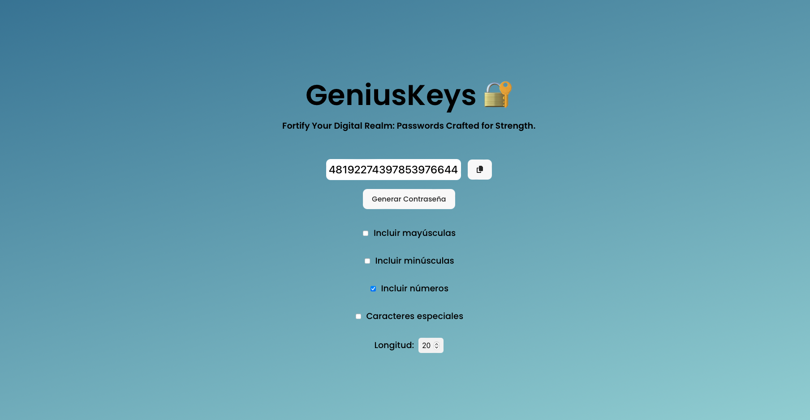

# GeniusKeys

## Description

GeniusKeys is a secure and easy-to-use password generator. With an intuitive user interface and customizable options, GeniusKeys allows users to generate strong, secure passwords with just a few clicks.

## Features
* Customizable: Users can specify the password length and choose whether to include uppercase letters, lowercase letters, numbers, and/or special characters.
* Secure: GeniusKeys generates random passwords that are hard to guess, helping to protect users' accounts from brute-force attacks.
* Easy to Use: With its simple, modern user interface, GeniusKeys is easy to use for anyone, regardless of their technical skill level.

## Installation
To install GeniusKeys, follow these steps:

1. Clone the repository: git clone `https://github.com/username/GeniusKeys.git``
2. Navigate to the project directory: cd GeniusKeys
3. Install the dependencies: npm install

## Usage
To use GeniusKeys, simply select your preferred options and click the "Generate Password" button. The generated password will be displayed on the screen.

## Contribution
Contributions to GeniusKeys are welcome. If you have a feature you'd like to add or a bug you'd like to fix, feel free to open an issue or a pull request.

## License
GeniusKeys is licensed under the MIT License. See the LICENSE file for more details.

## Contact
If you have any questions or comments about GeniusKeys, feel free to contact me at email.